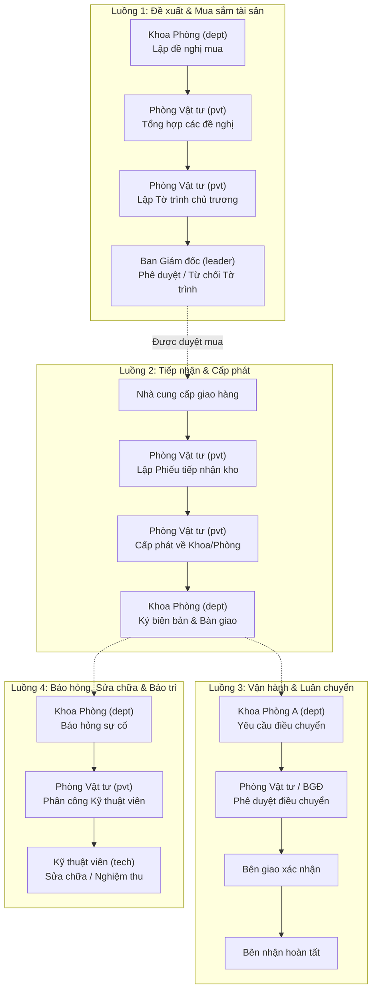

# TÀI LIỆU QUY TRÌNH LUỒNG HOẠT ĐỘNG & KỊCH BẢN KIỂM THỬ (TEST SCENARIOS)
## HỆ THỐNG QUẢN LÝ TÀI SẢN & TRANG THIẾT BỊ Y TẾ BỆNH VIỆN (QLTAISAN)

---

## PHẦN I: DANH SÁCH TÀI KHOẢN KIỂM THỬ THEO PHÂN QUYỀN

| STT | Họ tên hiển thị | Email đăng nhập | Mật khẩu | Vai trò (Role) | Phạm vi & Thẩm quyền chính |
|:---:|:---|:---|:---|:---|:---|
| **1** | **Quản trị viên** | `admin@hospital.local` | `Admin@12345` | `admin` | Toàn quyền quản trị hệ thống, quản lý người dùng, phân quyền, cấu hình danh mục, và có thể duyệt tất cả các quy trình. |
| **2** | **Cán bộ Phòng Vật tư** | `pvt@hospital.local` | `Pvt@12345` | `pvtttby` | Quản lý thiết bị toàn viện, tiếp nhận, cấp phát, điều chuyển, tổng hợp đề nghị mua, lập tờ trình chủ trương, bảo trì, thanh lý. |
| **3** | **Nhân viên Khoa Nội** | `dept@hospital.local` | `Dept@12345` | `department_staff` | Đại diện khoa/phòng: Lập đề nghị mua thiết bị của khoa, báo hỏng sự cố, xác nhận nhận thiết bị cấp phát/điều chuyển, mượn trả thiết bị. |
| **4** | **Kỹ thuật viên Thiết bị** | `tech@hospital.local` | `Tech@12345` | `technician` | Thực hiện sửa chữa thiết bị được giao, thực hiện bảo dưỡng định kỳ, ghi nhận kết quả kiểm định. |
| **5** | **Ban Giám đốc Bệnh viện** | `leader@hospital.local` | `Leader@12345` | `leader` | Cấp phê duyệt cao nhất: Phê duyệt Tờ trình chủ trương mua sắm, phê duyệt điều chuyển lớn, phê duyệt thanh lý, xem toàn bộ báo cáo viện. |

---

## PHẦN II: TỔNG QUAN SƠ ĐỒ CÁC LUỒNG HOẠT ĐỘNG CHÍNH (E2E)

---

## PHẦN III: CHI TIẾT CÁC LUỒNG & BƯỚC TEST CỤ THỂ

---

### LUỒNG 1: QUY TRÌNH ĐỀ XUẤT, TỔNG HỢP & PHÊ DUYỆT MUA SẮM TÀI SẢN
> **Mục tiêu**: Đảm bảo nhân viên khoa phòng chỉ lập đề nghị cho khoa của mình; Phòng Vật tư tổng hợp và lập tờ trình; Ban Giám đốc là cấp duy nhất có thẩm quyền phê duyệt tờ trình.

#### Bước 1.1: Khoa phòng lập Đề nghị mua tài sản
- **Tài khoản thực hiện**: `dept@hospital.local` (Nhân viên Khoa Nội)
- **Đường dẫn**: `/purchase-requests`
- **Các bước test**:
  1. Đăng nhập bằng tài khoản `dept@hospital.local` / `Dept@12345`.
  2. Truy cập menu **Đề xuất & Mua sắm** → Chọn **Đề nghị mua tài sản**.
  3. Bấm nút **"Lập đề nghị mua"**.
  4. **Kiểm tra giao diện Form modal**:
     - Trường **Khoa / Phòng đề nghị**: Tự động chọn sẵn `Khoa Nội Tổng hợp`. Mở dropdown chỉ thấy duy nhất `Khoa Nội Tổng hợp`, không thấy các khoa khác.
     - Trường **Nhóm thiết bị**: Là **Combobox (Select)** tải dữ liệu từ danh mục hệ thống do Admin quản lý (không phải ô nhập text tự do).
     - Kiểm tra toàn bộ placeholder tuân thủ chuẩn: `Vui lòng nhập / chọn + [tên nhãn]`.
  5. **Nhập thông tin đề nghị**:
     - Tên tài sản: `Máy theo dõi bệnh nhân đa thông số 2026`
     - Nhóm thiết bị: Chọn `Thiết bị chẩn đoán` (hoặc nhóm thiết bị có sẵn)
     - Mức độ ưu tiên: `Cao`
     - Số lượng: `2`, Đơn vị tính: `Bộ`
     - Đơn giá ước tính: `45.000.000`
     - Lý do đề nghị: `Thay thế thiết bị cũ đã hết hạn sử dụng`
  6. Bấm **"Lưu đề nghị"**.
  7. Tìm dòng đề nghị vừa tạo (trạng thái `Nháp`) → Bấm nút **"Gửi"** (Trình đề nghị).
- **Kết quả mong đợi**:
  - Đề nghị chuyển sang trạng thái `Đã gửi - chờ tổng hợp` (màu xanh dương).
  - Xuất hiện nút "Rút lại" nếu muốn hủy gửi khi chưa được tổng hợp.

#### Bước 1.2: Phòng Vật tư tổng hợp các đề nghị mua từ các khoa
- **Tài khoản thực hiện**: `pvt@hospital.local` (Phòng Vật tư)
- **Đường dẫn**: `/purchase-summaries`
- **Các bước test**:
  1. Đăng nhập bằng tài khoản `pvt@hospital.local` / `Pvt@12345`.
  2. Truy cập menu **Đề xuất & Mua sắm** → Chọn **Tổng hợp đề nghị**.
  3. Bấm nút **"Lập bảng tổng hợp"**.
  4. Nhập thông tin:
     - Tiêu đề: `Bảng tổng hợp đề nghị mua TTBYT Quý IV/2026`
     - Kỳ tổng hợp: `Quý IV/2026`
     - Ngày lập: Ngày hiện tại
     - Trong danh sách đề nghị chờ duyệt: Tích chọn đề nghị `Máy theo dõi bệnh nhân đa thông số 2026` của Khoa Nội.
  5. Bấm **"Lập bảng tổng hợp"**.
  6. Tại danh sách bảng tổng hợp: Bấm nút **"Hoàn thiện"** trên bảng vừa tạo.
- **Kết quả mong đợi**:
  - Bảng tổng hợp chuyển từ `Nháp` sang `Đã hoàn thiện` (màu xanh lá).
  - Các đề nghị con bên trong chuyển trạng thái sang `Đã tổng hợp`.

#### Bước 1.3: Phòng Vật tư lập Tờ trình chủ trương mua sắm trình BGĐ
- **Tài khoản thực hiện**: `pvt@hospital.local` (Phòng Vật tư)
- **Đường dẫn**: `/proposals`
- **Các bước test**:
  1. Tiếp tục với tài khoản `pvt@hospital.local`.
  2. Truy cập menu **Đề xuất & Mua sắm** → Chọn **Tờ trình chủ trương (BGĐ)**.
  3. Bấm nút **"Lập tờ trình"**.
  4. Điền form tờ trình:
     - Chọn Bảng tổng hợp: Chọn bảng `Bảng tổng hợp đề nghị mua TTBYT Quý IV/2026` đã hoàn thiện ở Bước 1.2.
     - Tiêu đề tờ trình: `Tờ trình về việc xin chủ trương mua sắm trang thiết bị y tế đợt 4/2026`
     - Tổng kinh phí đề xuất: `90.000.000` VNĐ
     - Căn cứ pháp lý: `Căn cứ nhu cầu thực tế Khoa Nội và kế hoạch phát triển kỹ thuật viện 2026`
     - Nội dung tờ trình: `Kính trình Ban Giám đốc xem xét phê duyệt chủ trương mua sắm...`
  5. Bấm **"Lập tờ trình"** → Tờ trình xuất hiện ở trạng thái `Nháp`.
  6. Bấm nút **"Trình BGĐ"**.
  7. **Kiểm tra phân quyền tài khoản `pvt`**:
     - Sau khi trình, trạng thái đổi thành `Đã trình BGĐ - chờ duyệt`.
     - **QUAN TRỌNG**: Kiểm tra trên giao diện tài khoản `pvt`, **tuyệt đối KHÔNG xuất hiện nút "Duyệt" và "Từ chối"** (Phòng Vật tư không được tự duyệt tờ trình của mình).
- **Kết quả mong đợi**:
  - Tờ trình gửi thành công lên hệ thống, tài khoản PVT chỉ có quyền xem Chi tiết.

#### Bước 1.4: Ban Giám đốc xem xét & Phê duyệt Tờ trình chủ trương
- **Tài khoản thực hiện**: `leader@hospital.local` (Ban Giám đốc Bệnh viện)
- **Đường dẫn**: `/proposals`
- **Các bước test**:
  1. Đăng xuất, đăng nhập tài khoản `leader@hospital.local` / `Leader@12345`.
  2. Truy cập menu **Đề xuất & Mua sắm** → Chọn **Tờ trình chủ trương (BGĐ)**.
  3. **Kiểm tra giao diện tài khoản Ban Giám đốc**:
     - **Không có** nút "Lập tờ trình" (vì đây là nhiệm vụ của Phòng Vật tư).
     - Trên dòng tờ trình ở trạng thái `Đã trình BGĐ - chờ duyệt`: **Hiển thị 2 nút "Duyệt" và "Từ chối"**.
  4. Bấm nút **"Chi tiết"** để xem thông tin bảng tổng hợp và danh sách thiết bị đính kèm.
  5. Bấm nút **"Duyệt"** (Phê duyệt).
  6. Modal phê duyệt hiển thị:
     - Placeholder: `Vui lòng nhập ý kiến phê duyệt`
     - Nhập ý kiến: `Đồng ý chủ trương mua sắm. Giao Phòng Vật tư triển khai theo quy định.`
  7. Bấm **"Xác nhận phê duyệt"**.
- **Kết quả mong đợi**:
  - Tờ trình chuyển sang trạng thái `BGĐ đã phê duyệt` (Tag màu xanh lá `APPROVED`).
  - Toàn bộ đề nghị mua tài sản trong đợt đã được phê duyệt chủ trương thành công.

---

### LUỒNG 2: TIẾP NHẬN TÀI SẢN MỚI & NHẬP KHO
> **Mục tiêu**: Khi nhà cung cấp bàn giao thiết bị theo hợp đồng, Phòng Vật tư lập phiếu tiếp nhận, kiểm tra số serial, in mã QR và lưu kho.

- **Tài khoản thực hiện**: `pvt@hospital.local` (Phòng Vật tư)
- **Đường dẫn**: `/receipts` và `/equipment`
- **Các bước test**:
  1. Đăng nhập tài khoản `pvt@hospital.local`.
  2. Vào **Quản lý thiết bị** → Chọn **Tiếp nhận thiết bị** (`/receipts`).
  3. Bấm **"Tạo phiếu tiếp nhận"**.
  4. Nhập các thông tin:
     - Số hóa đơn / Phiếu giao nhận: `HD-2026-8899`
     - Nhà cung cấp: Chọn một nhà cung cấp trong danh sách
     - Ngày tiếp nhận: Ngày hiện tại
     - Danh sách thiết bị tiếp nhận: Nhập mã, tên thiết bị, model, số serial, đơn giá, số lượng.
  5. Bấm **"Lưu phiếu"** → Phiếu ở trạng thái `Chờ xác nhận`.
  6. Bấm nút **"Xác nhận tiếp nhận"**.
  7. Vào menu **Danh sách thiết bị** (`/equipment`):
     - Kiểm tra thiết bị vừa tiếp nhận đã xuất hiện với trạng thái `Trong kho` (`IN_STOCK`) hoặc `Sẵn sàng sử dụng` (`AVAILABLE`).
     - Bấm xem chi tiết thiết bị → Bấm **"In mã QR"** để kiểm tra tính năng sinh mã QR phục vụ quét tem bằng điện thoại.
- **Kết quả mong đợi**:
  - Phiếu tiếp nhận được xác nhận thành công, tài sản chính thức được ghi nhận vào kho bệnh viện.

---

### LUỒNG 3: CẤP PHÁT THIẾT BỊ VỀ KHOA / PHÒNG SỬ DỤNG
> **Mục tiêu**: Phòng Vật tư xuất thiết bị trong kho cấp phát cho Khoa Nội; Khoa Nội xác nhận nhận bàn giao.

#### Bước 3.1: Phòng Vật tư lập phiếu cấp phát
- **Tài khoản thực hiện**: `pvt@hospital.local` (Phòng Vật tư)
- **Đường dẫn**: `/allocations`
- **Các bước test**:
  1. Đăng nhập bằng tài khoản `pvt@hospital.local`.
  2. Vào menu **Quản lý thiết bị** → Chọn **Cấp phát thiết bị** (`/allocations`).
  3. Bấm **"Tạo phiếu cấp phát"**.
  4. Chọn thiết bị đang ở trong kho (`IN_STOCK`).
  5. Chọn khoa/phòng thụ hưởng: `Khoa Nội Tổng hợp`.
  6. Nhập lý do: `Trang bị theo kế hoạch mua sắm Quý IV`.
  7. Bấm **"Lưu phiếu"** → Bấm **"Xác nhận cấp phát"** → Bấm **"Bàn giao"**.
- **Kết quả mong đợi**:
  - Phiếu cấp phát chuyển sang trạng thái đã bàn giao, chờ khoa xác nhận.

#### Bước 3.2: Khoa phòng xác nhận nhận bàn giao thiết bị
- **Tài khoản thực hiện**: `dept@hospital.local` (Khoa Nội)
- **Đường dẫn**: `/allocations` hoặc `/equipment`
- **Các bước test**:
  1. Đăng nhập bằng tài khoản `dept@hospital.local`.
  2. Vào danh sách thiết bị của khoa `/equipment`.
  3. Kiểm tra thiết bị đã chuyển đơn vị quản lý về `Khoa Nội Tổng hợp`, trạng thái là `Đang sử dụng` (`IN_USE`).
- **Kết quả mong đợi**:
  - Khoa phòng chính thức quản lý và chịu trách nhiệm với tài sản được cấp.

---

### LUỒNG 4: ĐIỀU CHUYỂN TÀI SẢN GIỮA CÁC KHOA
> **Mục tiêu**: Chuyển thiết bị từ Khoa Nội sang Khoa Cấp cứu khi có nhu cầu khẩn cấp.

#### Bước 4.1: Tạo yêu cầu điều chuyển
- **Tài khoản thực hiện**: `dept@hospital.local` (Khoa giao) hoặc `pvt@hospital.local`
- **Đường dẫn**: `/transfers`
- **Các bước test**:
  1. Đăng nhập `dept@hospital.local`.
  2. Vào **Quản lý thiết bị** → **Điều chuyển thiết bị** (`/transfers`).
  3. Bấm **"Tạo yêu cầu"**.
  4. Chọn thiết bị cần chuyển (đang thuộc Khoa Nội).
     - Trường **Đơn vị đang thụ hưởng**: Tự động điền `Khoa Nội Tổng hợp`.
     - Trường **Đơn vị nhận**: Chọn `Khoa Cấp cứu`.
     - Nhập lý do: `Hỗ trợ cấp cứu dịch bệnh đột xuất`.
  5. Bấm **"Gửi yêu cầu"**.
- **Kết quả mong đợi**:
  - Phiếu điều chuyển tạo thành công ở trạng thái `Chờ duyệt` (`PENDING`).

#### Bước 4.2: Phê duyệt & Bàn giao điều chuyển
- **Tài khoản thực hiện**: `pvt@hospital.local` hoặc `leader@hospital.local`
- **Các bước test**:
  1. Đăng nhập `pvt@hospital.local` hoặc `leader@hospital.local`.
  2. Vào `/transfers` → Tìm phiếu điều chuyển → Bấm **"Duyệt"**.
  3. Bên giao bấm: **"Bên giao xác nhận"** (Bàn giao).
  4. Bên nhận (`Khoa Cấp cứu`) hoặc PVT bấm: **"Bên nhận hoàn tất"**.
- **Kết quả mong đợi**:
  - Trạng thái phiếu: `Hoàn tất` (`COMPLETED`).
  - Đơn vị quản lý của thiết bị được cập nhật tự động sang `Khoa Cấp cứu`.

---

### LUỒNG 5: BÁO HỎNG SỰ CỐ, PHÂN CÔNG & SỬA CHỮA THIẾT BỊ
> **Mục tiêu**: Khoa phòng báo sự cố máy hỏng; Phòng Vật tư phân công Kỹ thuật viên; Kỹ thuật viên sửa chữa và bàn giao lại cho khoa.

#### Bước 5.1: Khoa phòng lập phiếu Báo hỏng thiết bị
- **Tài khoản thực hiện**: `dept@hospital.local` (Nhân viên Khoa Nội)
- **Đường dẫn**: `/damage-reports`
- **Các bước test**:
  1. Đăng nhập `dept@hospital.local`.
  2. Vào **Kỹ thuật & bảo dưỡng** → Chọn **Báo hỏng thiết bị** (`/damage-reports`).
  3. Bấm **"Báo hỏng mới"**.
  4. Chọn thiết bị bị hỏng trong khoa.
  5. Chọn mức độ nghiêm trọng: `Khẩn cấp` hoặc `Cao`.
  6. Mô tả sự cố: `Máy bật không lên nguồn, có mùi khét nhẹ`.
  7. Bấm **"Gửi báo hỏng"**.
- **Kết quả mong đợi**:
  - Phiếu báo hỏng tạo thành công, trạng thái `Chờ tiếp nhận`. Thiết bị tự động chuyển trạng thái `Chờ sửa chữa`.

#### Bước 5.2: Phòng Vật tư phân công Kỹ thuật viên
- **Tài khoản thực hiện**: `pvt@hospital.local` (Phòng Vật tư)
- **Các bước test**:
  1. Đăng nhập `pvt@hospital.local` → Vào `/damage-reports`.
  2. Chọn phiếu báo hỏng vừa tạo → Bấm **"Phân công"**.
  3. Chọn Kỹ thuật viên: `Kỹ thuật viên Thiết bị (tech@hospital.local)`.
  4. Bấm **"Xác nhận phân công"**.
- **Kết quả mong đợi**:
  - Phiếu chuyển sang trạng thái `Đã phân công`.

#### Bước 5.3: Kỹ thuật viên tiến hành sửa chữa & Hoàn tất
- **Tài khoản thực hiện**: `tech@hospital.local` (Kỹ thuật viên)
- **Đường dẫn**: `/repairs`
- **Các bước test**:
  1. Đăng nhập `tech@hospital.local` / `Tech@12345`.
  2. Vào **Kỹ thuật & bảo dưỡng** → Chọn **Sửa chữa thiết bị** (`/repairs`).
  3. Tìm phiếu sửa chữa được phân công → Bấm **"Tiếp nhận sửa chữa"**.
  4. Cập nhật chi tiết sửa: Thay tụ nguồn, vệ sinh bo mạch; Chi phí: `500.000` VNĐ.
  5. Bấm **"Hoàn tất sửa chữa"**.
- **Kết quả mong đợi**:
  - Phiếu sửa chữa chuyển thành `Hoàn tất`.
  - Thiết bị phục hồi về trạng thái `Sẵn sàng sử dụng` (`AVAILABLE`).

---

### LUỒNG 6: KẾ HOẠCH BẢO TRÌ & KIỂM ĐỊNH ĐỊNH KỲ
> **Mục tiêu**: Đảm bảo toàn bộ thiết bị y tế được bảo trì và kiểm định an toàn theo chu kỳ pháp quy.

- **Tài khoản thực hiện**: `pvt@hospital.local` hoặc `tech@hospital.local`
- **Đường dẫn**: `/maintenance` và `/inspections`
- **Các bước test**:
  1. Đăng nhập `pvt@hospital.local`.
  2. Vào **Bảo trì định kỳ** (`/maintenance`):
     - Kiểm tra danh sách kế hoạch bảo trì theo tháng/quý.
     - Bấm xem chi tiết một kế hoạch bảo trì → Cập nhật biên bản thực hiện bảo trì.
  3. Vào **Kiểm định thiết bị** (`/inspections`):
     - Kiểm tra danh sách thiết bị sắp hết hạn kiểm định (tem màu vàng/đỏ).
     - Tạo phiếu kiểm định mới: Nhập số tem kiểm định, đơn vị kiểm định độc lập, ngày kiểm định và ngày hết hạn chu kỳ mới.
     - Bấm **"Lưu kết quả kiểm định"**.
- **Kết quả mong đợi**:
  - Chu kỳ kiểm định của thiết bị được gia hạn mới, hệ thống tự động tính ngày cảnh báo cho chu kỳ tiếp theo.

---

### LUỒNG 7: MƯỢN / TRẢ THIẾT BỊ Y TẾ
> **Mục tiêu**: Khoa Cấp cứu mượn tạm thời thiết bị từ Khoa Khác hoặc Kho; Hoàn trả khi sử dụng xong.

- **Tài khoản thực hiện**: `dept@hospital.local` và `pvt@hospital.local`
- **Đường dẫn**: `/loans`
- **Các bước test**:
  1. Đăng nhập `dept@hospital.local`.
  2. Vào menu **Vận hành & Kiểm kê** → Chọn **Mượn / Trả thiết bị** (`/loans`).
  3. Tạo phiếu mượn: Chọn thiết bị cần mượn, mục đích mượn, ngày dự kiến trả.
  4. Tài khoản quản lý thiết bị hoặc PVT bấm **"Duyệt cho mượn"** → Trạng thái thiết bị chuyển sang `Đang cho mượn` (`ON_LOAN`).
  5. Sau khi dùng xong, bấm **"Xác nhận trả thiết bị"** → Kiểm tra tình trạng nguyên vẹn → Bấm hoàn tất.
- **Kết quả mong đợi**:
  - Thiết bị quay trở lại trạng thái `Sẵn sàng sử dụng` tại đơn vị sở hữu gốc.

---

### LUỒNG 8: KIỂM KÊ TÀI SẢN BỆNH VIỆN
> **Mục tiêu**: Đối chiếu số lượng thực tế với số lượng sổ sách phần mềm.

- **Tài khoản thực hiện**: `pvt@hospital.local` (Phòng Vật tư)
- **Đường dẫn**: `/inventories`
- **Các bước test**:
  1. Đăng nhập `pvt@hospital.local` → Chọn **Kiểm kê tài sản** (`/inventories`).
  2. Bấm **"Tạo đợt kiểm kê mới"**:
     - Tên đợt: `Kiểm kê tài sản cuối năm 2026 - Khoa Nội`
     - Phạm vi: `Khoa Nội Tổng hợp`
  3. Mở đợt kiểm kê → Nhập kết quả kiểm kê thực tế theo mã thiết bị (Khớp / Thừa / Thiếu / Hỏng).
  4. Bấm **"Hoàn thành đợt kiểm kê"**.
- **Kết quả mong đợi**:
  - Hệ thống xuất biên bản đối chiếu kiểm kê và danh sách chênh lệch (nếu có).

---

### LUỒNG 9: THU HỒI & THANH LÝ TÀI SẢN
> **Mục tiêu**: Lập hội đồng và thanh lý các thiết bị đã hỏng không thể sửa chữa hoặc hết khấu hao.

- **Tài khoản thực hiện**: `pvt@hospital.local` (Lập đề xuất) và `leader@hospital.local` (Phê duyệt)
- **Đường dẫn**: `/liquidations`
- **Các bước test**:
  1. Đăng nhập `pvt@hospital.local` → Vào **Thanh lý tài sản** (`/liquidations`).
  2. Bấm **"Đề xuất thanh lý"** → Chọn thiết bị ở trạng thái hỏng / hết niên hạn → Nhập lý do và hình thức thanh lý.
  3. Đăng xuất, đăng nhập `leader@hospital.local` → Vào `/liquidations` → Bấm **"Phê duyệt thanh lý"**.
- **Kết quả mong đợi**:
  - Trạng thái thiết bị chuyển sang `Đã thanh lý` (`LIQUIDATED`), không còn tính vào tài sản đang vận hành của bệnh viện.

---

### LUỒNG 10: BÁO CÁO THỐNG KÊ & QUẢN TRỊ HỆ THỐNG
> **Mục tiêu**: Xuất báo cáo viện và quản trị người dùng, vai trò.

- **Tài khoản thực hiện**: `admin@hospital.local` (Quản trị viên)
- **Đường dẫn**: `/reports`, `/users`, `/roles`, `/audit-logs`
- **Các bước test**:
  1. Đăng nhập `admin@hospital.local` / `Admin@12345`.
  2. Vào **Báo cáo & Thống kê** (`/reports`):
     - Lọc theo khoa/phòng, trạng thái thiết bị, năm mua sắm.
     - Bấm **"Xuất báo cáo Excel"** / **"In danh sách"**.
  3. Vào **Quản trị hệ thống**:
     - `/users`: Thêm người dùng mới, khóa tài khoản, đổi khoa phòng.
     - `/roles`: Xem và gán nhóm quyền chi tiết cho từng vai trò.
     - `/audit-logs`: Kiểm tra nhật ký lịch sử mọi thao tác thay đổi (Tạo, Sửa, Xóa, Duyệt) có ghi rõ người thực hiện, địa chỉ IP và thời gian.
- **Kết quả mong đợi**:
  - Dữ liệu báo cáo chính xác, bảo mật nhật ký minh bạch.

---

## PHẦN IV: BẢNG TỔNG HỢP KIỂM THỬ NHANH (CHECKLIST)

| STT | Luồng kiểm thử | Tài khoản thực hiện | Thao tác trọng tâm | Trạng thái mong đợi |
|:---:|:---|:---|:---|:---:|
| 1 | Lập đề nghị mua | `dept@hospital.local` | Chọn Khoa (chỉ thấy Khoa Nội), chọn nhóm thiết bị từ Combobox | `SUBMITTED` |
| 2 | Tổng hợp đề nghị | `pvt@hospital.local` | Gộp các đề nghị đã gửi thành bảng tổng hợp | `FINALIZED` |
| 3 | Lập tờ trình mua sắm | `pvt@hospital.local` | Trình tờ trình lên BGĐ, kiểm tra KHÔNG có nút Duyệt | `SUBMITTED` |
| 4 | Phê duyệt tờ trình | `leader@hospital.local` | Thấy nút Duyệt/Từ chối, nhập ý kiến phê duyệt | `APPROVED` |
| 5 | Tiếp nhận thiết bị | `pvt@hospital.local` | Nhập kho thiết bị mới từ NCC, in mã QR | `IN_STOCK` |
| 6 | Cấp phát thiết bị | `pvt@hospital.local` → `dept` | Xuất kho cấp phát về Khoa Nội | `IN_USE` |
| 7 | Điều chuyển thiết bị | `dept` → `leader`/`pvt` | Chuyển máy từ Khoa Nội sang Cấp cứu | `COMPLETED` |
| 8 | Báo hỏng & Sửa chữa | `dept` → `pvt` → `tech` | Báo hỏng, phân công KTV, sửa chữa hoàn tất | `AVAILABLE` |
| 9 | Bảo trì & Kiểm định | `pvt` / `tech` | Cập nhật biên bản bảo trì, gia hạn tem kiểm định | `UPDATED` |
| 10 | Thanh lý tài sản | `pvt` → `leader` | Lập biên bản thanh lý và Giám đốc phê duyệt | `LIQUIDATED` |
| 11 | Quản trị & Nhật ký | `admin@hospital.local` | Kiểm tra nhật ký thao tác và phân quyền RBAC | `PASS` |

---
*Tài liệu được cập nhật tự động theo phiên bản mã nguồn mới nhất của hệ thống QLTAISAN.*
